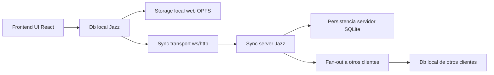

# React + Jazz: Etapa 2 - schema de datos y flujo end-to-end

Este documento aterriza la Etapa 2 del roadmap: definir un schema de datos solido y entender que hace frontend, backend y sync server con ese schema.

## 1) Objetivo de la etapa

1. Definir tablas, tipos y relaciones que representen el dominio real del producto.
2. Tener una unica fuente de verdad del modelo de datos.
3. Entender el flujo completo de una escritura: UI -> storage local -> sync -> servidor -> otros clientes.

## 2) Que representa schema.ts en Jazz

schema.ts es el contrato tipado de datos de la app.

1. Define tablas y columnas.
2. Define relaciones via refs.
3. Exporta app con defineApp(...).
4. Ese app se usa en frontend, permissions y backend.

Referencias base:

1. [starters/react-localfirst/schema.ts](../starters/react-localfirst/schema.ts)
2. [starters/react-localfirst/permissions.ts](../starters/react-localfirst/permissions.ts)
3. [examples/todo-server-ts/schema.ts](../examples/todo-server-ts/schema.ts)
4. [examples/todo-server-ts/src/main.ts](../examples/todo-server-ts/src/main.ts)

## 3) Plantilla recomendada de schema (base realista)

Ejemplo para arrancar una app tipo proyectos + tareas + comentarios:

```ts
import { schema as s } from "jazz-tools";

const schema = {
  users: s.table({
    displayName: s.string(),
    email: s.string(),
  }),
  projects: s.table({
    name: s.string(),
    ownerId: s.ref("users"),
    archived: s.boolean(),
  }),
  tasks: s.table({
    projectId: s.ref("projects"),
    title: s.string(),
    done: s.boolean(),
    assigneeId: s.ref("users").optional(),
    dueAtIso: s.string().optional(),
  }),
  comments: s.table({
    taskId: s.ref("tasks"),
    authorId: s.ref("users"),
    body: s.string(),
  }),
};

type AppSchema = s.Schema<typeof schema>;
export const app: s.App<AppSchema> = s.defineApp(schema);
```

Notas practicas:

1. Empieza pequeno: 3 a 5 tablas maximo.
2. Evita columnas "multiuso" sin semantica (ejemplo: data, meta, payload para todo).
3. Nombra relaciones por intencion de dominio (projectId, ownerId, assigneeId).
4. Deja optimizaciones de indexado para despues de validar flujo real.

Reglas importantes del DSL oficial:

1. Las columnas `s.ref(...)` deben terminar en `Id` o `_id`.
2. Si usas arrays de refs, usa `Ids` o `_ids`.
3. `schema.ts` es el origen de verdad; `permissions.ts` va separado y las migraciones van en `migrations/`.

Referencias:

1. [docs/content/docs/schemas/defining-tables.mdx](../docs/content/docs/schemas/defining-tables.mdx)
2. [docs/content/docs/schemas/column-types.mdx](../docs/content/docs/schemas/column-types.mdx)

## 4) Compartir schema entre frontend y backend

Si tienes frontend y backend separados, comparte el mismo modulo de schema.

Patron recomendado en monorepo:

1. packages/domain-jazz/src/schema.ts
2. apps/web/schema.ts reexporta app desde domain-jazz
3. apps/api/schema.ts reexporta app desde domain-jazz

Resultado:

1. Frontend y backend hablan el mismo modelo.
2. Evitas drift entre contratos.
3. Las migraciones y permissions se aplican sobre el mismo app.

## 5) Flujo end-to-end con ese schema

### Flujo narrado

1. Frontend renderiza datos con useAll(app.tabla) y muta con db.insert/update/delete.
2. La mutacion entra primero al runtime local (local-first).
3. En web persistente, ese estado local vive en OPFS (no SQLite).
4. El cliente sincroniza cambios al sync server usando serverUrl.
5. El sync server valida auth/permisos y persiste en su storage (SQLite en runtime Node dev server).
6. Otros clientes reciben cambios y actualizan su storage local.

Referencias del flujo:

1. [starters/react-localfirst/src/main.tsx](../starters/react-localfirst/src/main.tsx)
2. [starters/react-localfirst/src/todo-widget.tsx](../starters/react-localfirst/src/todo-widget.tsx)
3. [packages/jazz-tools/src/runtime/db.ts](../packages/jazz-tools/src/runtime/db.ts)
4. [crates/jazz-wasm/src/runtime.rs](../crates/jazz-wasm/src/runtime.rs)
5. [packages/jazz-tools/src/backend/create-jazz-context.ts](../packages/jazz-tools/src/backend/create-jazz-context.ts)
6. [packages/jazz-tools/src/dev/dev-server.ts](../packages/jazz-tools/src/dev/dev-server.ts)
7. [crates/jazz-napi/src/lib.rs](../crates/jazz-napi/src/lib.rs)

### Diagrama rapido



## 6) Storage por capa (respuesta directa)

1. Frontend web Jazz:
- Persistente: OPFS.
- Memoria: si se usa driver memory.

2. Backend Node con Jazz runtime:
- Persistente: SQLite via NAPI runtime.
- Memoria: si se configura driver memory.

3. Sync server local de Jazz:
- Persistente: SQLite por defecto.
- Memoria: con bandera inMemory.

4. Better Auth en starters:
- Demo actual usa memoryAdapter (no persistente).
- Para produccion, cambiar a adaptador persistente.

## 7) Estado actual y faltantes para cerrarla al 100%

Estado:

1. La guia ya cubre bien la base tecnica de schema y flujo end-to-end.

Faltantes para tu caso real (si aun no estan hechos):

1. Sustituir la plantilla ejemplo por tus entidades reales de negocio.
2. Definir cardinalidades y ownership de cada relacion (para preparar Etapa 3 y 4).
3. Elegir tipos de columna finales (incluyendo estrategia para archivos/blobs si aplica).
4. Validar localmente el schema antes de pasar a las siguientes etapas.

Comando recomendado de validacion:

```bash
pnpm dlx jazz-tools@alpha validate
```

## 8) Checklist de salida de Etapa 2

1. Existe schema.ts versionado con tablas de dominio reales.
2. Frontend usa app del schema compartido.
3. Backend usa el mismo app del schema compartido.
4. Hay al menos un flujo CRUD funcionando extremo a extremo.
5. El equipo entiende donde persiste cada capa (OPFS vs SQLite vs memoria).

## 9) Siguiente paso recomendado

Despues de cerrar este documento, sigue con Etapa 3 (data patterns):

1. Elegir patron principal de modelado (nested o collaborative list).
2. Ajustar schema a ese patron.
3. Dejar listo el terreno para Etapa 4 (access control y permissions).

Referencias:

1. [docs/content/docs/recipes/data-patterns/nested-data.mdx](../docs/content/docs/recipes/data-patterns/nested-data.mdx)
2. [docs/content/docs/recipes/data-patterns/real-time-collaborative-list.mdx](../docs/content/docs/recipes/data-patterns/real-time-collaborative-list.mdx)
